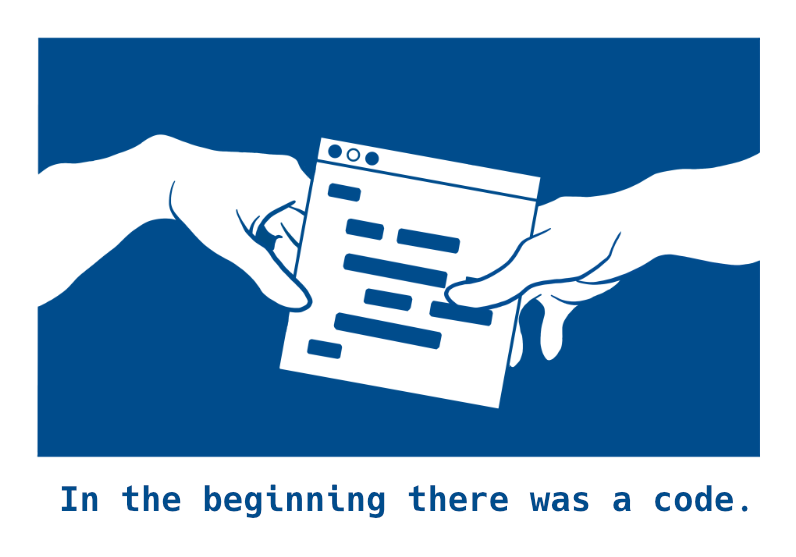

얼마 전 중국에서 티셔츠를 판매할 때 인연을 맺은 지인 분을 만났다. 중국 촌 동네 노점 바닥에서 추억들을 함께 했기 때문에 지금도 꾸준히 연락하며 종종 만나고 있다. 그날도 그때 그 시절 이야기를 하며 웃고 떠들다 지인분께서 갑자기 한국에서도 티셔츠를 만들어 팔아보라고 이야기해주셨다.([@chef_stage1](https://instagram.com/chef_stage1?igshid=3zny1r3uc9q4) 님 감사합니다!)

집으로 돌아오는 길에 만약 한국에서 티셔츠를 만든다면 무엇을 할까 곰곰이 생각해보았다. 그러다 이전 회사에서 다른 개발자 분들이 단체로 개발자 티셔츠를 샀던 기억이 떠올랐다. 그때 함께 구매는 하지 않았지만 호기심에 개발자 티셔츠를 구글링 해보았는데 대부분의 티셔츠가 유명한 개발자 meme들을 단순히 붙여 넣는데 그쳐 아쉬움이 있었다.

이전에 티셔츠를 만들었던 경험도 있었기 때문에 개발자와 관련된 티셔츠를 만들어 보기로 하였다. 아이디어를 주변 분들과 이야기하다 이전 동료 개발자 한 분께서 같이 해보자고 제안해주셨고 2명이서 프로젝트를 본격적으로 시작하게 되었다.

프로젝트의 이름은 devgoods로 정했다. 우선 총 7가지의 디자인을 만들었고 주변 개발자 분들에게 먼저 보여드렸다. 감사하게도 호응해 주시는 분들이 많았다. 이에 자신감을 가지고 실제 판매할 수 있는 채널들을 찾기 시작했다. 처음에는 크라우드 펀딩을 고민했었다. 하지만 우리가 직접 배송과 CS를 담당해야 한다는 점이 부담스러웠는데 마침 [마플샵](https://marpple.shop)이라는 서비스를 알게 되었다.

마플샵은 크리에이터가 디자인을 등록하면 마플에서 판매부터 배송까지를 모두 담당해주는 서비스였다. 그리고 수익을 마플과 크리에이터가 나누어 가진다. 우리에게 딱 맞는 서비스였고 바로 마플샵 크리에이터로 등록 신청을 했다. 크리에이터 신청은 통과되었고 이제 본격적인 판매를 앞두고 있다.

판매가 시작되면 다음의 일들을 진행할 계획이다.

* 제품 사진 촬영하기 
  마플샵에서 기본적으로 제공해주는 상품 사진뿐만 아니라 실제 착용 사진, 컨셉 사진 등도 추가로 촬영할 계획이다. 개발자의 nerd 함을 잘 담을 수 있는 컨셉을 기획 중이고 조만간 촬영을 할 수 있을 것 같다.

* landing page 직접 만들기 
  [webflow](https://webflow.com)를 사용해 빠르게 landing page를 만들었다. 투자한 시간 대비 나름 괜찮은 결과물이라고 생각하지만 기본 템플릿에서 커스텀을 해서 사용하기에는 어려움이 있었다.(물론 강력한 커스텀 기능이 있지만 html, css, javascript를 다룰 수 있다면 직접 코딩하는 것이 더 효율적이라는 생각이다.) 당분간은 webflow page를 계속 쓸 예정이지만 추후 직접 개발한 landing page로 변경할 계획이다.

* 전 세계에 굿즈 판매하기 
  한국에서의 판매가 잘 진행되면 다음은 북미 지역에 판매를 해볼 계획이다. 마플샵에서 해외 배송도 지원해주기 때문에 배송 걱정은 없고 어떻게 홍보를 해야 할지 고민이다. 우선은 Reddit 커뮤니티를 통해 홍보를 해볼 계획이다.

그동안 많은 분들이 사이드 프로젝트를 진행하고 그 경험을 공유하는 것이 부러웠었다. 이번 사이드 프로젝트를 애정을 가지고 잘 진행해 나도 이 경험을 많은 분들과 공유할 수 있으면 좋겠다. 공유와 기록의 목적으로 앞으로 프로젝트를 진행 사항들을 꾸준히 블로그에 남기려 한다.

 

> devgoods 프로젝트는 [링크](https://devgoods.webflow.io/)에서 확인하실 수 있습니다. 
> 프로젝트에 관해 이야기 하고 싶으신 분들은 자유롭게 연락주세요. 
> <contact@yunsangho.com>