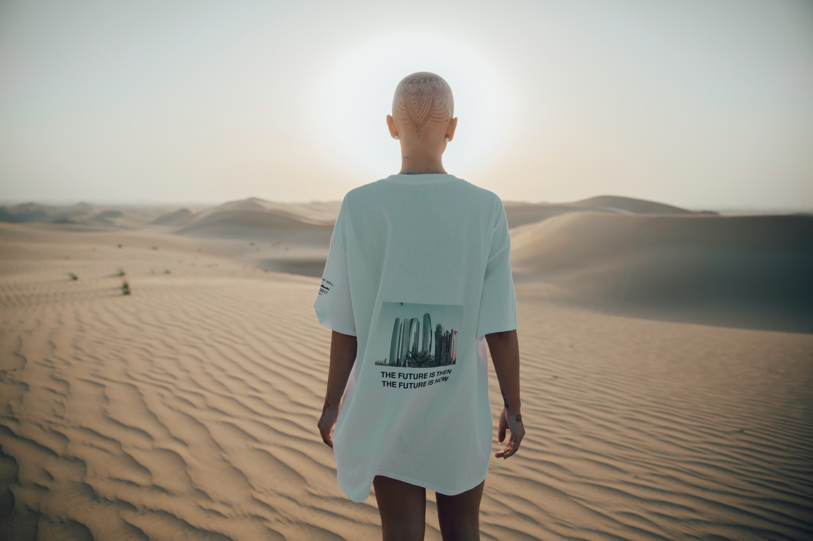

<a style="background-color:black;color:white;text-decoration:none;padding:4px 6px;font-family:-apple-system, BlinkMacSystemFont, &quot;San Francisco&quot;, &quot;Helvetica Neue&quot;, Helvetica, Ubuntu, Roboto, Noto, &quot;Segoe UI&quot;, Arial, sans-serif;font-size:12px;font-weight:bold;line-height:1.2;display:inline-block;border-radius:3px" href="https://unsplash.com/@ahmedcarter?utm_medium=referral&amp;utm_campaign=photographer-credit&amp;utm_content=creditBadge" target="_blank" rel="noopener noreferrer" title="Download free do whatever you want high-resolution photos from Ahmed Carter"><svg xmlns="http://www.w3.org/2000/svg" style="height:12px;width:auto;position:relative;vertical-align:middle;top:-2px;fill:white" viewBox="0 0 32 32"><title>unsplash-logo</title><path d="M10 9V0h12v9H10zm12 5h10v18H0V14h10v9h12v-9z"></path></svg>Ahmed Carter</a>

> 26살이 되던 해 3월 2일을 기억한다. 
> 바리깡이 지나갈 때마다 떨어지던 머리카락을 기억한다. 
> 무거운 내 마음을 비웃듯 너무도 가볍게 
> 두피와 머리카락을 분리하던 면도기를 기억한다. 
> 그렇게 나는 대머리가 되었다.

20살부터 탈모가 시작되었다. 머리 빠지기 꽤나 이른 나이이다. 무엇 때문에 머리가 빠지기 시작했는지 정확히는 알 수 없지만 한 가지 짚이는 데가 있다.

고등학교 시절 노리스 스키퍼(norris skipper) 스타일로 수염을 기르고 싶었다. 노리스 스키퍼는 입술 아래부터 턱까지 수염을 길러 연결하는 스타일이다. 하지만 충분한 수염을 가지고 있지 않았고 풍성한 수염을 가지기 위해 수염 발모제를 구매했다. 근사한 수염을 가진 내 모습을 상상하며 매일 열심히 발모제를 발랐고 어느 날 수염이 자라기 시작했다.

하지만 무엇을 얻기 위해서는 무엇인가를 잃어야 한다는 말처럼 나의 머리가 빠지기 시작했다. 뉴턴의 제2법칙처럼 털량은 보존되었다. 털은 갑자기 생기거나, 없어지지 않았고 단지 그 형태만 변화할 뿐이었다.
그 이후로 탈모는 계속 꾸준히 진행되었고 나는 풍성함을 되찾기 위해 노력했다. 아니 다시 풍성해지는 것까지는 바라지 않았다. 단지 더 이상 빠지지 않기를 부족함이 드러나지 않기만을 바랬다. 하지만 나의 바람은 잘 이루어지지 않았다.

그 시기 우연히 떠난 여행에서 다양한 사람을 만났다. 그중 몇몇은 정말 멋있었다. 그들이 멋있었던 이유는 그들의 이야기 때문이었다. 그들은 어디에서도 들을 수 없는 자신 만의 이야기를 해주었다. 그리고 앞으로 어떠한 이야기를 만들어 나갈 것인지 그것을 위해 어떠한 노력을 하고 있는지도 말해주었다.

그때부터 나에게 한 가지 목표가 생겼다. 나만의 이야기를 만들자. 그리고 스스로에게 물었다. 나에게 정말 부족한 것은 무엇일까? 무엇이 나를 풍성하게 만들까?

그렇게 나는 대머리가 되었다.

나만의 이야기를 만들기 위해 우선 여행을 택했다. 별다른 이유는 없었다. 그냥 그 당시 내가 할 줄 아는 것이 여행뿐이었다. 감사하게도 다른 여행자 그리고 현지인 분들의 호의 덕분에 다양한 경험을 할 수 있었다. 같이 일하고 먹었고 쉬었고 놀았다.

때론 대머리가 큰 도움이 되었다. 특히 동남아시아 불교 국가들을 여행할 때 빛을 발했다. 절의 스님들은 나를 반겼고 주지 스님과 나는 서로에게 엄지를 들었다. 사람들은 항상 친절을 베풀어 주었다.

여행을 통해서 다양한 경험을 할 수 있었고 여행이 끝났을 때 적지만 나의 이야기들이 생겼다. 그 이야기들을 바탕으로 더 많은 경험을 할 수 있었고 더 많은 이야기가 쌓였다. 이제 쌓인 이야기들을 하나씩 해보려고 한다. 궁금하다, 나의 이야기는 얼마나 재미있을까.

> 내 머리는 풍성함을 잃었지만 나는 더 풍성해졌다. 
> 오늘도 나는 대머리로 산다.