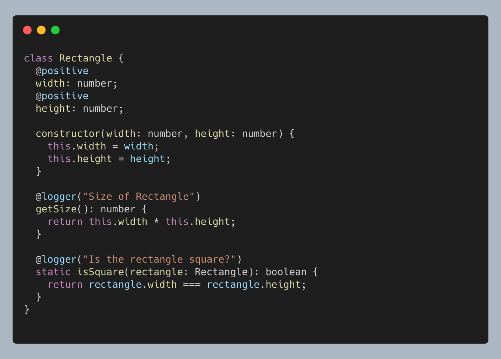

## Method Decorator

Method decorator는 3가지 parameter를 가진 함수이다.

- **target**

  static method일 경우에는 class의 constructor

  instance method일 경우에는 class의 prototype

- key

  method의 이름

- descriptor

  method의 property descriptor

```tsx
const logger = (message: string) => (
  target: any,
  key: string,
  descriptor: PropertyDescriptor
) => {
  const originalMethod = descriptor.value

  descriptor.value = function(...args: any) {
    console.log(`[LOG] ${message} - ${originalMethod.apply(this, args)}`)
  }

  return descriptor
}
class Rectangle {
  width: int
  height: int

  constructor(width, height) {
    this.width = width
    this.height = height
  }

  @logger('Size of Rectangle')
  // logger decorator의 parameter로 Rectangle.prototype, 'getSize', getSize의 propertyDescripor가 주어진다.
  public getSize(): int {
    return this.width * this.height
  }

  @logger('Is the rectangle square?')
  // logger decorator의 parameter로 Rectangle.constructor, 'isSquare', isSquare의 propertyDescripor가 주어진다.
  static isSquare(rectangle: Rectangle): bool {
    return rectangle.width === rectangle.height
  }
}

new Rectangle(10, 10).getSize()
Rectangle.isSquare(new Rectangle(10, 10))
// [LOG] Size of Rectangle - 100
// [LOG] Is the rectangle square? - true
```

## Property Decorator

Property decorator 함수를 만들기 위해선 2가지 parameter가 필요하다.

- target

  static property일 경우에는 class의 constructor

  instance property일 경우에는 class의 prototype

- key

  property의 이름

```tsx
const positive = (target: any, key: string) => {
  let value = target[key]

  Object.defineProperty(target, key, {
    get: () => `${value}`,
    set: v => {
      // setter를 설정하여 음수일 경우 error를 발생시킨다.
      if (v <= 0) {
        throw new Error(`${String(key)} must be a positive number`)
      }
      value = v
    },
    enumerable: true,
    configurable: true,
  })
}

class Rectangle {
  @positive
  // positive decorator의 target으로 Rectangle.constructor, key로 "width"가 주어진다.
  width: number
  @positive
  // positive decorator의 target으로 Rectangle.constructor, key로 "height"가 주어진다.
  height: number

  constructor(width: number, height: number) {
    this.width = width
    this.height = height
  }

  @logger('Size of Rectangle')
  getSize(): number {
    return this.width * this.height
  }

  @logger('Is the rectangle square?')
  static isSquare(rectangle: Rectangle): boolean {
    return rectangle.width === rectangle.height
  }
}

new Rectangle(-1, -1)
// Error: width must be a positive number
```

## 도움 받은 글

Opensource. (2019). [Decorators](https://www.typescriptlang.org/docs/handbook/decorators.html). [Docs] TypeScript-Handbook.

Addy Osmani (2015). [Exploring EcmaScript Decorators](https://medium.com/google-developers/exploring-es7-decorators-76ecb65fb841). [Blog] Google Developers
