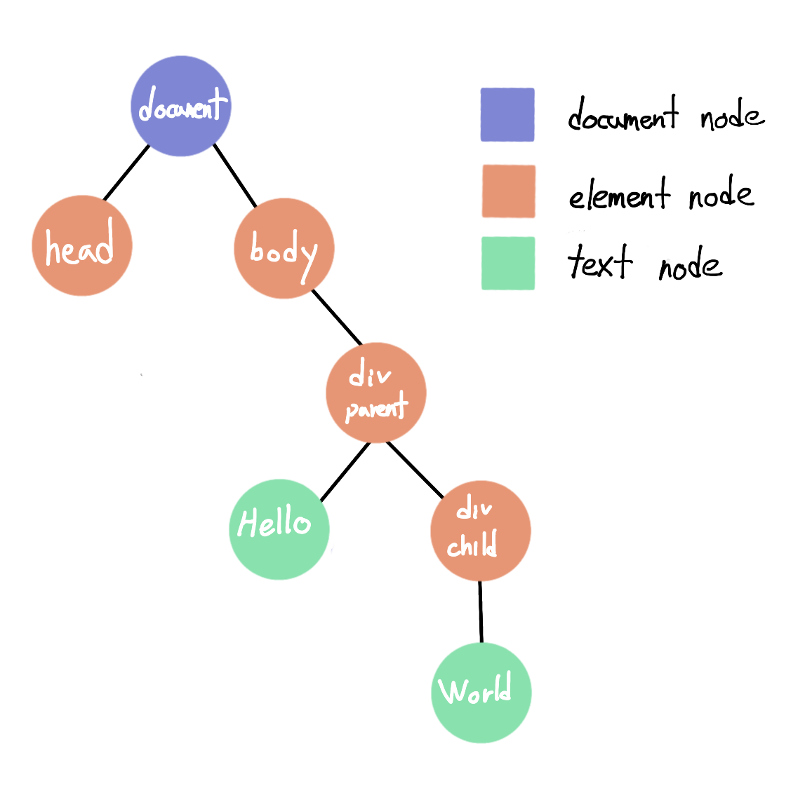
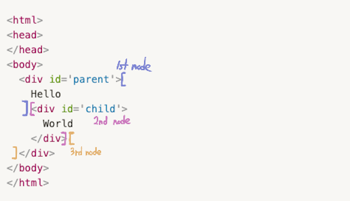

최근 코딩을 하다 dom element와 dom node의 차이점을 제대로 알지 못해서 어려움을 겪었다. 이에 dom interface에 관해 간단히 글로 정리해본다.

## DOM Interface란?

- html, xml 문서를 프로그래밍 언어로 쉽게 조작할 수 있도록 **object 모델을 활용해 tree 구조**로 나타낸 것
- dom은 javascript와 독립적이다. javascript는 DOM을 다룰 수 있는 여러 프로그래밍 언어 중에 하나이다.
- broswer DOM API = DOM + Javascript

## DOM의 구성요소

### Node
- **dom을 구성하는 객체**들을 통칭하여 node라고 부른다.
- node에는 다양한 type이 존재하는데 특히 자주 접하는 type으로는 element, document, text 등이 있다.

### Document
- dom tree의 **최상단** node이다.
- dom tree의 다른 node들은 모두 document node의 자식으로 존재한다.

#### window 객체 와의 차이점
* web browser는 객체들의 계층 구조로 이루어져 있는데 그중 최상위 객체가 window이다.
* window 객체는 location, history, screen 등 broswer context를 가지고 있다.
* javascript global 객체, 함수 그리고 변수들도 window 객체에 포함되어 있다.
* broswer의 tab 마다 고유한 window 객체를 가진다.
* document node도 window 객체의 property이다.

### Element
- **tag**들은 element node로 표현된다.
- element node의 자식으로 다른 node들이 존재할 수 있다.

### Text
- **문자**로 이루어진 내용들은 dom에서 text node로 표현된다.
- tag 내부에 문자가 존재한다면 tag element node의 자식 text node로 표현된다.

## Example
```html
<html>
<head>
</head>
<body>
  <div id='parent'>
    Hellow
    <div id='child'>
      World
    </div>
  </div>
</body>
</html>
```
#### 위의 html은 어떤 dom 구조를 가지고 있을까?



- dom tree의 최상단은 document node, 그 아래로 다른 node들이 존재한다.
- html tag는 element node로 표현된다. 자식 tag는 자식 element node로 표현된다.
- tag에 text가 존재한다면 element 내부 text node로 표현된다.
- 실제로 browser에서 parent div element의 자식 node를 살펴보면 3가지 node로 이루어진 list를 얻을 수 있다. 2개가 아닌 3개의 자식 node를 가지고 있는 이유는 html의 가독성을 위해 우리가 입력했던 **white space들도 text node로 표현**되기 때문이다. 첫 번째 node는 text node로 parnet `<div>` tag 바로 뒤부터 child `<div>` tag 앞 까지, 두 번째 node는 child div element, 세 번째 node는 text node로서 child의 `</div>` 뒤부터, parent의 `</div>` 앞까지이다.


